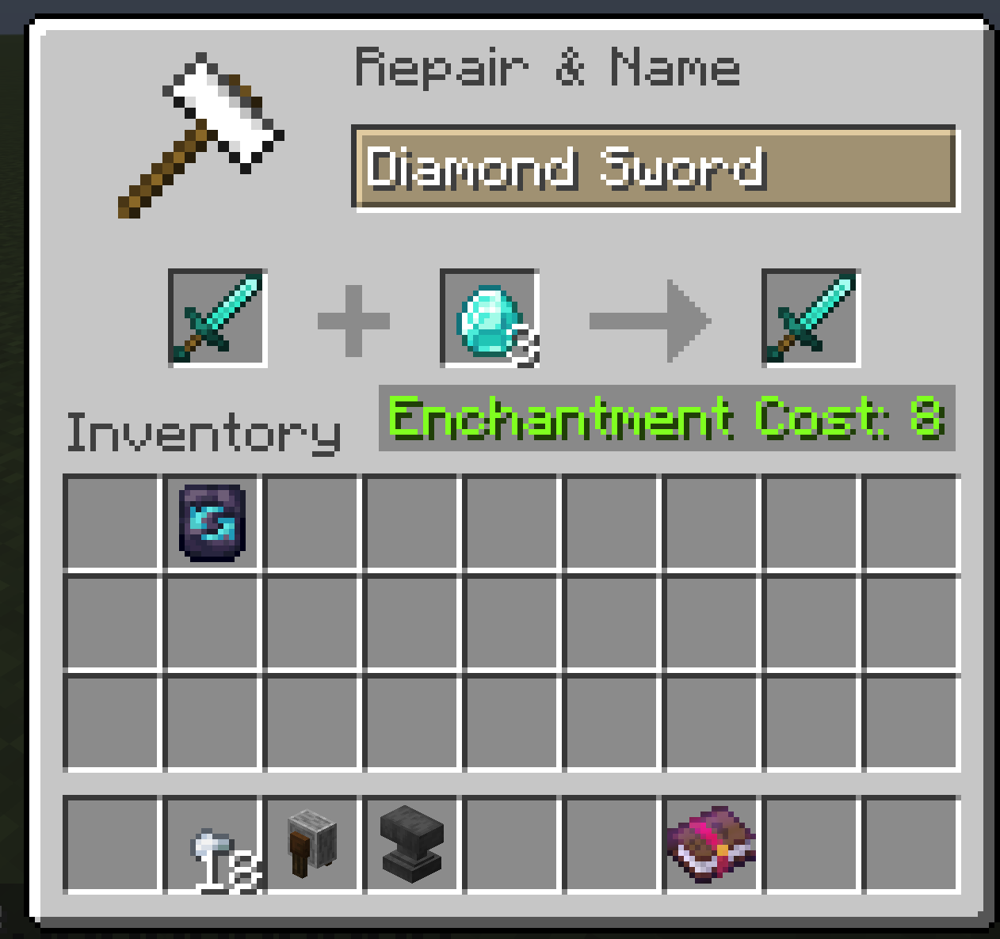

# Anvil and Grindstone

## Anvil

The anvil is a maintenance station. Enchantment combining has been removed. Books go in chiseled bookshelves instead (see [[Enchanting Table]]).

| Action | Status |
|---|---|
| Repair (material) | Works, fixed cost, no escalation |
| Rename | Works |
| Slot restoration | Works, restores grindstone penalties |
| Book application | Removed |
| Item + item combining | Removed |
| Too Expensive | Removed |
| Prior Work Penalty | Removed |

### Slot Restoration

After a grindstone removes enchantments and applies a -1 slot penalty, the anvil restores the lost slot. Place the item in the left slot and any of its repair materials in the right slot. Restoration accepts the same materials that repair the item's durability, so anything added by tags, datapacks, or other mods works too.

Repair Materials:

| Item Material | Repair Material |
|---|---|
| Netherite | Netherite Ingot or Diamond |
| Diamond | Diamond |
| Gold | Gold Ingot |
| Iron / Chainmail | Iron Ingot |
| Copper | Copper Ingot |
| Leather | Leather |
| Wood | Oak Planks |
| Stone | Cobblestone |

Restoration XP Cost:

| Item Material | XP Cost |
|---|---|
| Netherite | 10 levels |
| Diamond | 8 levels |
| Gold / Iron / Chainmail | 5 levels |
| Copper | 3 levels |
| Leather / Wood / Stone | 2 levels |

## Grindstone

The grindstone removes all enchantments from an item but permanently reduces the max slot count by 1. Re-enchanting becomes progressively more constrained unless you restore the slot via the anvil (see above).

The penalty appears as dark red "broken" pips at the end of the [[Enchanting Table]] slot bar.
