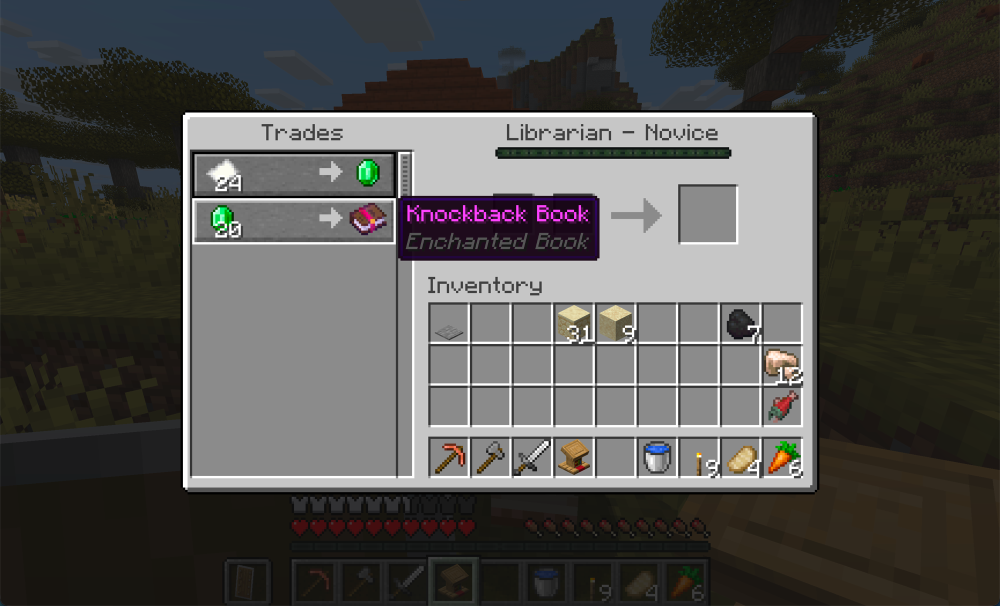

# Book Locations

Enchanted books are found in structure loot chests. Each structure has a curated pool with no random enchantments. Place books in chiseled bookshelves near the [[Enchanting Table]] to permanently add them to the catalogue.

## Easy (Overworld Surface)

| Structure | Enchantments |
|---|---|
| Village Temple | Feather Falling, Step-Up, Knockback |
| Village Weaponsmith | Knockback |
| Village Armorer | Feather Falling |
| Village Toolsmith | Step-Up |
| Village Fisher | Luck of the Sea, Lure |
| Village Houses | Feather Falling, Knockback, Step-Up |
| Igloo | Frost Walker |
| Shipwreck (treasure) | Luck of the Sea, Lure |
| Shipwreck (supply) | Luck of the Sea |

## Medium (Overworld Underground / Structures)

| Structure | Enchantments |
|---|---|
| Simple Dungeon | Knockback, Thorns, Punch |
| Ruined Portal | Curse of Fragility, Vanishing Curse |
| Underwater Ruin (small) | Aqua Affinity, Respiration |
| Desert Temple | Channeling, Curse of Fragility, Fire Aspect |
| Jungle Temple | Thorns, Vanishing Curse, Looting, Curse of Hunger |
| Ocean Ruins (big) | Depth Strider, Aqua Affinity, Respiration, Riptide, Loyalty |
| Mineshaft | Silk Touch, Fortune |
| Pillager Outpost | Multishot, Piercing, Quick Charge, Sweeping Edge, Punch |

## Hard (Nether / Deep Overworld)

| Structure | Enchantments |
|---|---|
| Buried Treasure | Riptide, Loyalty, Depth Strider |
| Nether Fortress | Fire Aspect, Flame, Venom, Looting |
| Woodland Mansion | Sweeping Edge, Looting, Curse of Hunger, Silk Touch, Thorns |
| Bastion (all variants) | Soul Speed |
| Stronghold Library | Infinity, Fortune |
| Stronghold Corridor | Fortune |
| Stronghold Crossing | Infinity |

The Stronghold Library has been remodeled with chiseled bookshelves pre-filled with books from the easy pool, acting as a ready-made starter enchanting setup.

## Endgame

| Structure | Enchantments |
|---|---|
| Ancient City | Veil, Swift Sneak, Curse of Binding |
| Trial Chambers (rare) | Wind Burst, Breach, Lunge, Last Stand |
| Trial Chambers (ominous rare) | Wind Burst, Breach, Lunge, Last Stand |
| End City | Mending |

These 8 enchantments (Veil, Swift Sneak, Curse of Binding, Wind Burst, Breach, Lunge, Last Stand, Mending) also trigger the [[Forbidden Knowledge|Advancements]] advancement when placed in a chiseled bookshelf.

## Villager Trades

| Villager | Books |
|---|---|
| Librarian | Feather Falling, Knockback |
| Cleric | Frost Walker, Luck of the Sea |
| Weaponsmith | Step-Up |

Villager-sold books are limited to common enchantments. Rare and endgame books are found only through exploration.

