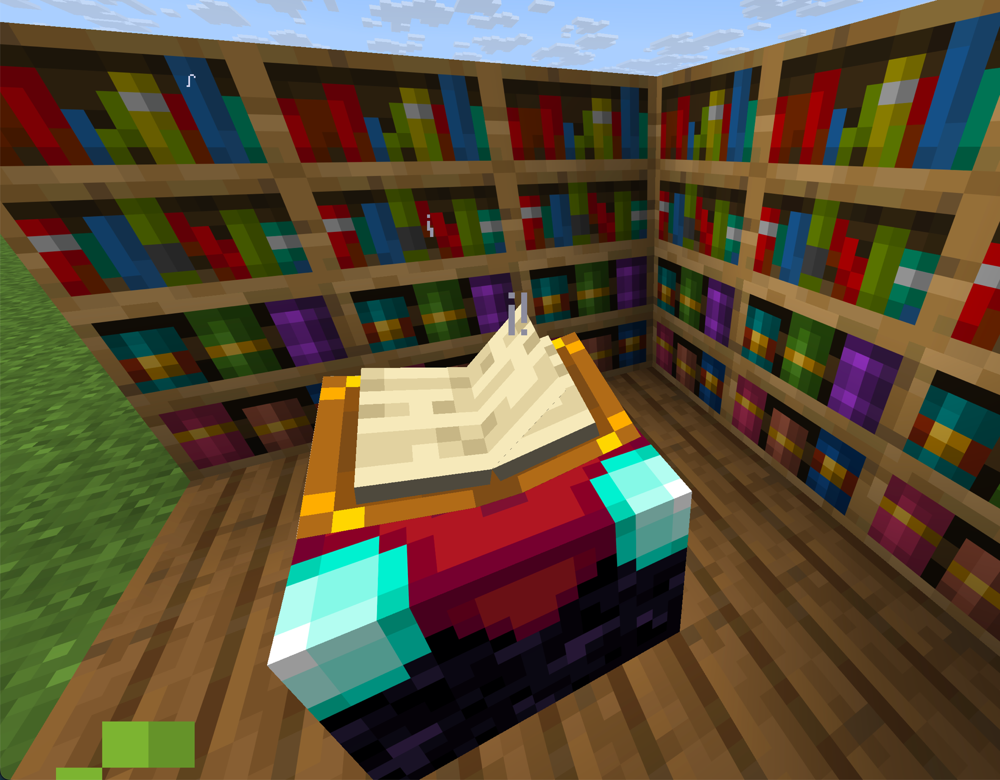
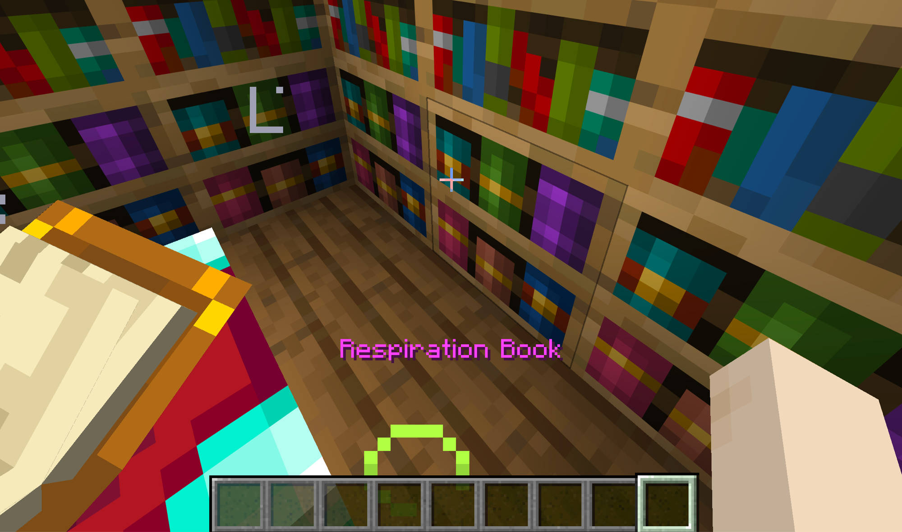
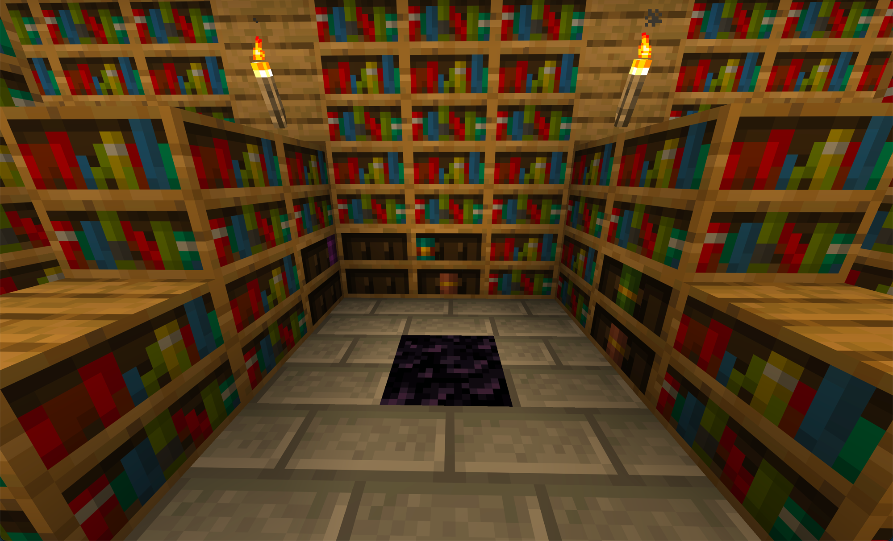
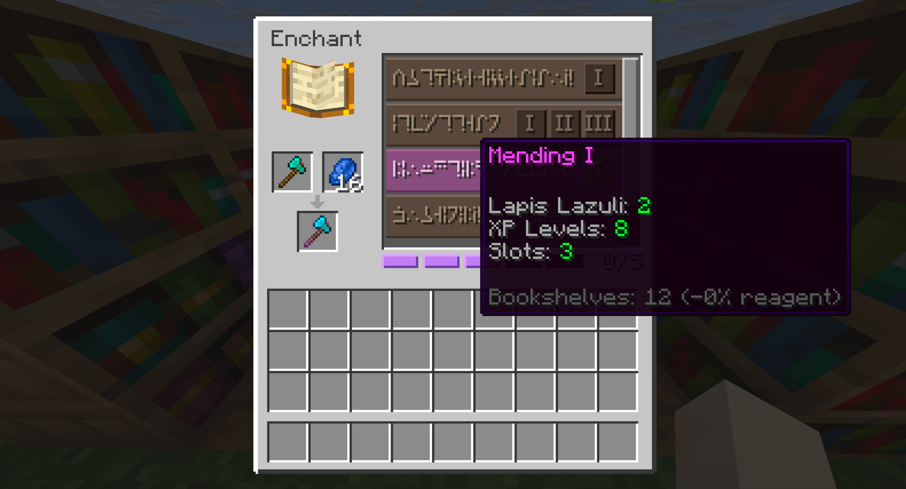
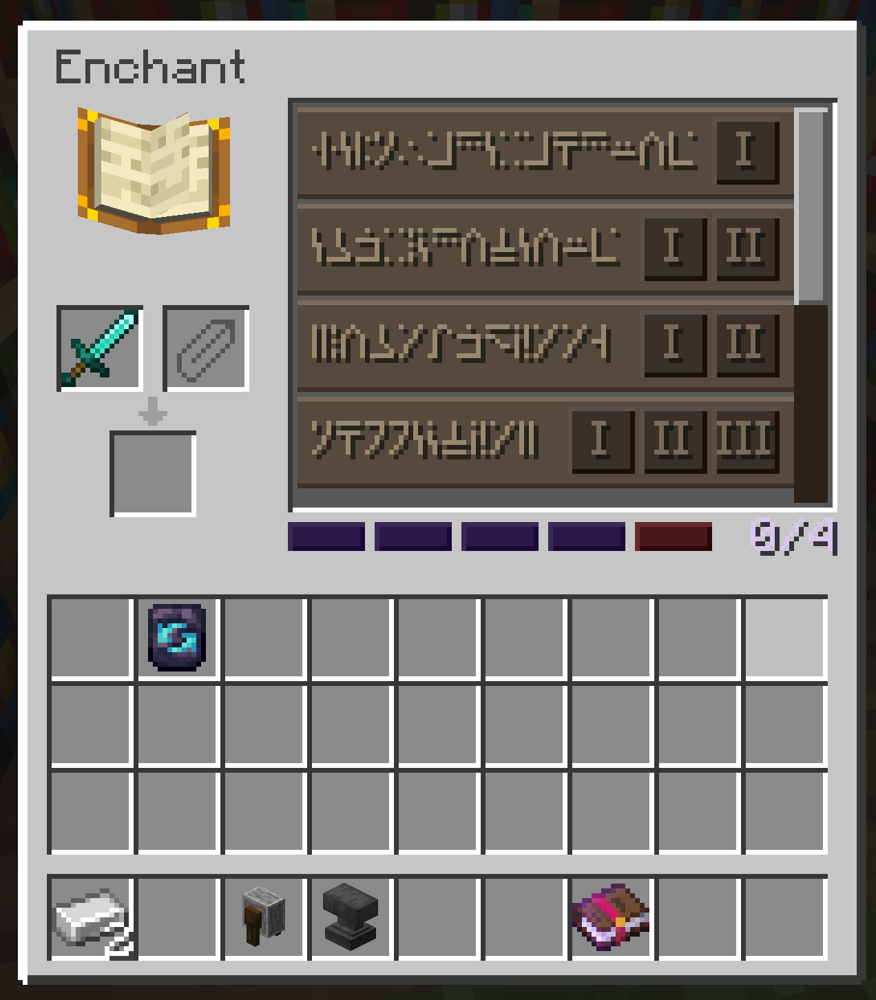

# Enchanting Table (Magic Only)

The enchanting table keeps the same block and appearance. The UI changes completely. A catalogue replaces vanilla RNG. You pay with a reagent and XP.

## Slot System

Each enchantable item has a max slot count determined by the material. Each enchantment level costs 1 slot. You cannot exceed the maximum.

| Material | Slots | Examples |
|---|---|---|
| Leather / Wood / Stone | 3 | Mending (3) fills everything |
| Copper | 3 | Same as Leather |
| Iron / Chainmail | 4 | Mending (3) + Fortune I (1) |
| Diamond | 5 | Mending (3) + Fortune II (2) |
| Netherite | 5 | Same as Diamond |
| Gold | 6 | Fortune III (3) + Thorns III (3) |

Gold has 6 slots and the lowest protection. By design, gold rewards players who sacrifice defense for magical options.

Special items: Trident/Mace/Elytra (5), Turtle Helmet (5), Crossbow (4), Bow/Fishing Rod (3).

### Slot Rules
- 1 level = 1 slot
- Exception: Mending costs 3 slots
- Curses cost 0 slots and grant +1 bonus slot each
- The grindstone removes all enchantments but permanently reduces max slots by 1 (restorable via anvil)

## Adding Enchantments to the Catalogue

Find enchanted books in structures, place them in chiseled bookshelves around the enchanting table. The enchantment appears in the catalogue. The book is not consumed and acts as a permanent key.

Chiseled bookshelves with books emit enchanting particles toward the table, showing the connection visually. Hovering on a slotted book in a chiseled bookshelf shows the enchantment name above the hotbar without breaking the shelf.

Normal bookshelves reduce reagent cost. The discount is linear: each bookshelf reduces the reagent cost by ~3.3%, up to 15 bookshelves for a 50% discount. Beyond 15 bookshelves there is no additional benefit.

## Stronghold Library

The vanilla Stronghold Library has been remodeled into a starter enchanting room. The center now hosts an obsidian pedestal flanked by chiseled bookshelves pre-filled with random enchanted books drawn from the early-game pool. This gives you a guaranteed first taste of the enchanting catalogue once you reach the Stronghold.

## UI Layout

Left side (3 slots): item on top, reagent beside it, result on the bottom.

Right side (scrollable catalogue): each row shows the enchantment name and a level selector (I, II, III...). Hovering shows the reagent cost, XP cost, and slot cost. Unaffordable rows and level buttons appear dimmed and are not clickable.

Bottom (visual slot bar): pips show used, pending, and free slots. Grindstone penalties appear as dark red broken pips at the end. Scales to fit any slot count.

## Cost

Each enchantment costs a specific reagent and XP levels:
- Reagent: a thematic item specific to each enchantment. Base cost is 2 per level, reduced by normal bookshelves (up to 50% at 15 bookshelves).
- XP levels: 2 (level I), 4 (level II), 7 (level III), 10 (level IV+). Mending always costs 8 XP regardless of level.

### Example: Fortune III on Diamond Pickaxe (5 slots, 10 bookshelves)

| Level | Slots | Reagent (Emerald) | Reagent (reduced) | XP |
|---|---|---|---|---|
| I | 1 | 2 | 2 | 2 levels |
| II | 2 | 4 | 3 | 4 levels |
| III | 3 | 6 | 4 | 7 levels |

## Curses

Curses cost 0 slots and grant +1 bonus slot instead. This is the primary way to expand an item beyond the material limit. Risk/reward tradeoff.

| Curse | Negative Effect | Bonus |
|---|---|---|
| Curse of Fragility | Double durability damage | +1 slot |
| Curse of Hunger | 30% faster hunger per piece | +1 slot |
| Curse of Binding | Cannot remove armor | +1 slot |
| Curse of Vanishing | Item disappears on death | +1 slot |

## Grindstone

Removes all enchantments but permanently reduces max slots by 1. Lost slots appear as dark red "broken" pips at the end of the slot bar. The anvil restores lost slots using the matching repair material (see [[Anvil and Grindstone]]).

