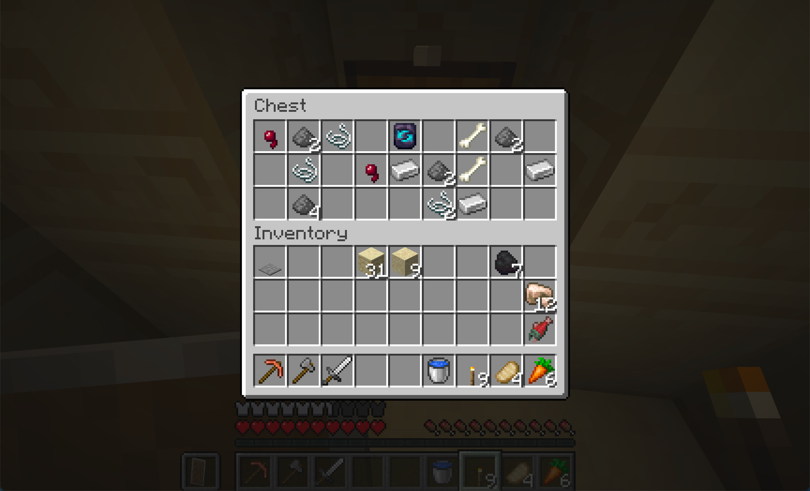

# Getting Started

This mod changes how enchanting works from the ground up. Here is what to expect in your first session.

## What Changed

The enchanting table no longer rolls random enchantments. You find enchanted books in structures and place them in chiseled bookshelves near the table. Each book makes one enchantment permanently available in the catalogue. Stat enchantments like Sharpness, Protection, Unbreaking, and Efficiency are gone. They are now smithing upgrades you apply at the [[Smithing Table]].

## Early Game (Overworld Start)

1. Find a smithing template. Honing, Warding, Tempering, or Grinding templates spawn in structure chests. Your first one will likely come from a village weaponsmith or a dungeon.

2. Upgrade your gear. Place the template in the [[Smithing Table]] with a Copper Ingot for a level I boost. Iron, Gold, Diamond, and Netherite give higher tiers.
3. Duplicate your template. Surround the template with 8 Copper Ingots and the matching signature material in a crafting table. See [[Smithing Table]] for materials.

## Mid Game (Structures)

4. Collect enchanted books. Each structure has a curated pool. Villages have Feather Falling and Knockback. Dungeons have Thorns. Mineshafts have Fortune and Silk Touch. See [[Book Locations]] for the full list.
5. Set up an enchanting station. Place chiseled bookshelves within 2 blocks of an enchanting table. Slot your books in. Each book permanently adds the enchantment to the catalogue.
6. Enchant your gear. Open the enchanting table, select an enchantment from the catalogue, place the matching [[reagent|Enchantment List]] in the bottom slot, and pay the XP cost.
7. Surround with normal bookshelves. Each bookshelf (up to 15) reduces the reagent cost by ~3.3%, maxing at 50% discount.

## Late Game (Nether, End)

8. Hunt endgame books. Mending (End City), Veil (Ancient City), Wind Burst (Trial Chambers). These are the rarest and most impactful.
9. Push your slots. Higher-tier materials give more enchantment slots. Gold gives the most (6) at the cost of durability. Curses grant +1 bonus slot each for a risk/reward tradeoff.
10. Max your smithing. Netherite upgrades (level V) on all templates give the strongest stat boosts. The [[Walking Fortress|Advancements]] advancement requires Warding V on a full armor set.

## The Stronghold Library

When you reach the Stronghold, the library has been remodeled with an obsidian pedestal and chiseled bookshelves pre-filled with enchanted books from the early-game pool. This is your guaranteed starter enchanting setup if you have not built one yet.

## Quick Reference

| I want to... | Go to... |
|---|---|
| Upgrade weapon damage | [[Smithing Table]] (Honing template) |
| Add Protection to armor | [[Smithing Table]] (Warding template) |
| Enchant with Mending or Fortune | [[Enchanting Table]] (find the book first) |
| Know what reagent I need | [[Enchantment List]] |
| Find a specific book | [[Book Locations]] |
| Remove an enchantment | [[Anvil and Grindstone]] (Grindstone section) |
| Understand slot limits | [[Enchanting Table]] (Slot System section) |
