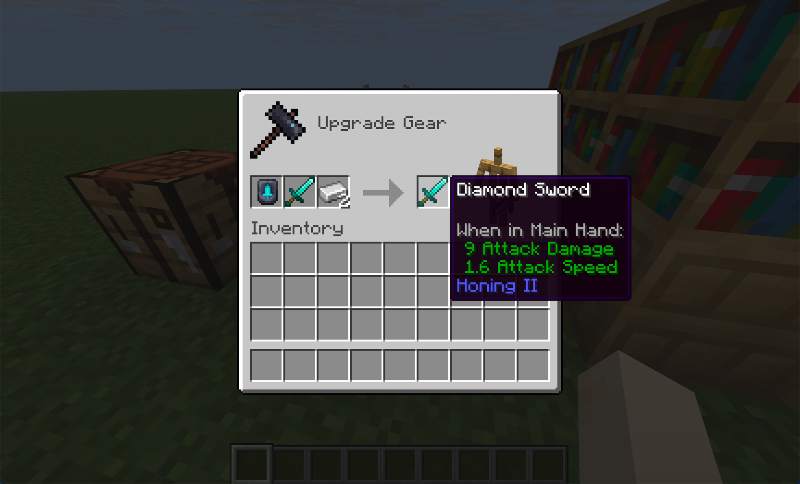
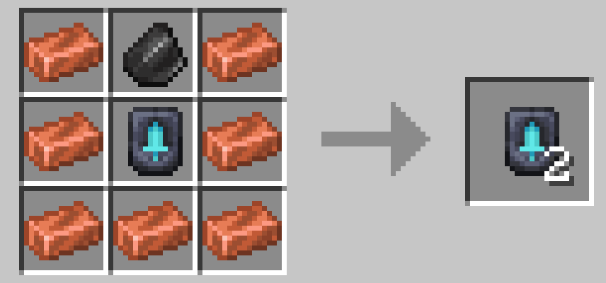
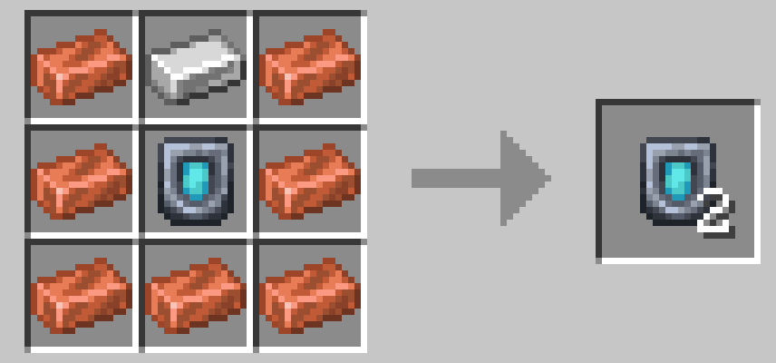
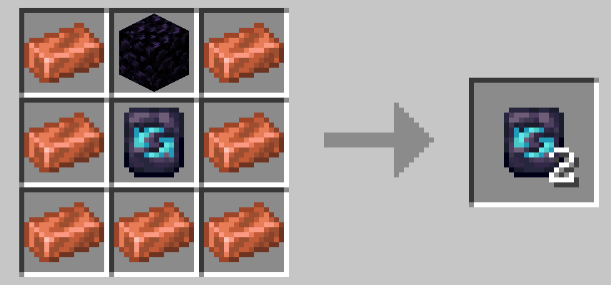
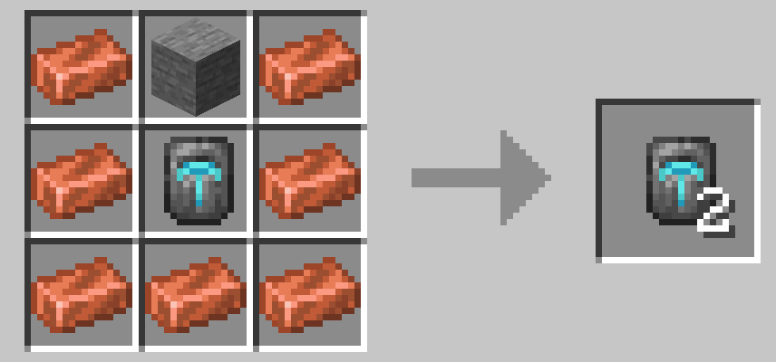
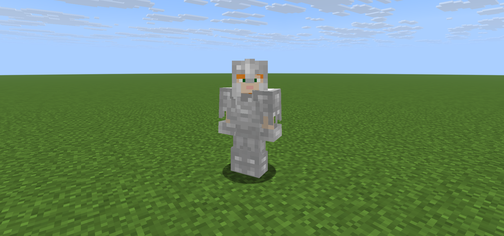

# Smithing Table (Stat Boosts)

Templates found in structures determine the upgrade type. The material in the second slot determines the level. One upgrade per category per item.

## Templates

| Template | Replaces | Effect | Sources |
|---|---|---|---|
| Honing | Sharpness, Power, Density | Weapon damage | Weaponsmith, Pillager Outpost, Stronghold Library, Dungeon |
| Warding | Protection | Damage reduction | Armorer, Bastion Treasure, Buried Treasure, Jungle Temple |
| Tempering | Unbreaking | Durability | Toolsmith, Mineshaft, Desert Pyramid, Shipwreck |
| Grinding | Efficiency | Mining speed | Mineshaft, Dungeon, Desert Pyramid, Ruined Portal, Trial Chambers |

You duplicate templates via shaped crafting. Each uses the same shape (8 copper ingots surrounding the template) but a unique signature material in the top center slot:

| Template | Signature Material |
|---|---|
| Honing | Flint |
| Warding | Iron Ingot |
| Tempering | Obsidian |
| Grinding | Stone |

## Levels by Material

| Material | Level |
|---|---|
| Copper | I |
| Iron | II |
| Gold | III |
| Diamond | IV |
| Netherite | V |

No XP cost. The only cost is the template and the material. Any material higher than the current level works. An item at level III goes directly to V with a Netherite Ingot. Unupgraded items (level 0) start at any tier.

### What each upgrade modifies

| Template | Attribute Changed |
|---|---|
| Honing | Base attack damage (stacks with the weapon's existing damage) |
| Warding | Flat damage reduction (applied via armor calculation) |
| Tempering | Effective durability (reduces durability loss) |
| Grinding | Mining efficiency bonus (+5 per level) |

## Visual Changes

Warding and Tempering upgrades on armor are visible as overlays on the 3D model, tinted to match the armor material. Both overlays stack together and are compatible with vanilla cosmetic trims.

